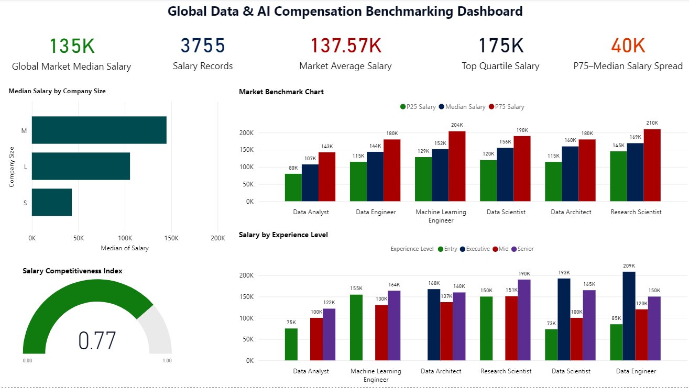

# Global Data & AI Compensation Benchmarking Analysis

## 1. Project Overview

This project analyzes global salary data across data and AI roles to benchmark market compensation patterns and understand how pay varies across roles, experience levels, and company sizes.

The goal was to simulate a real-world compensation benchmarking analysis similar to those conducted by HR analytics and compensation teams when evaluating salary competitiveness in the labor market.

The analysis focuses on:

* Market salary benchmarking using percentile analysis (P25, Median, P75)
* Compensation differences across job roles
* Salary progression across experience levels
* Pay differences across company sizes
* Market competitiveness using a compensation index

Python was used for data preparation and benchmark calculations, while Power BI was used to build an interactive compensation analytics dashboard.

---

## 2. Dataset Information

| Metric              | Value                                                             |
| ------------------- | ----------------------------------------------------------------- |
| Raw Salary Records  | 3,755                                                             |
| Roles Analyzed      | 6 major data & AI roles                                           |
| Experience Levels   | Entry, Mid, Senior, Executive                                     |
| Compensation Metric | Salary (USD)                                                      |
| Variables Included  | Job title, experience level, company size, location, remote ratio |

**Dataset Source:** Data Science Job Salaries Dataset (Kaggle)
[https://www.kaggle.com/datasets/ruchi798/data-science-job-salaries](https://www.kaggle.com/datasets/adilshamim8/salaries-for-data-science-jobs)

Note: The dataset is not included in this repository. Please download it directly from Kaggle using the link above.

---

## 3. Data Cleaning & Preparation

The raw dataset was processed using Python (Pandas) to prepare it for compensation analysis.

Key preparation steps included:

* Filtering records to include **full-time employment roles**
* Selecting relevant variables such as job title, experience level, and salary
* Standardizing compensation using the **salary_in_usd** variable
* Filtering roles with sufficient sample sizes for reliable benchmarking
* Creating aggregated tables for role-level salary benchmarking

These steps ensured the dataset was suitable for percentile-based compensation analysis.

---

## 4. Compensation Benchmarking Methodology

The analysis uses percentile benchmarking, a standard method used in salary surveys and compensation reviews.

Three benchmark values were calculated for each role:

| Metric       | Meaning                                           |
| ------------ | ------------------------------------------------- |
| P25          | Lower quartile salary (below-market compensation) |
| Median (P50) | Typical market salary                             |
| P75          | Top quartile salary (premium compensation)        |

These benchmarks allow organizations to understand where compensation sits relative to the market.

Additional metrics were also calculated:

* **Salary Spread:** difference between P75 and median salaries
* **Competitiveness Index:** ratio of median salary to top-quartile salary
* **Experience-level salary benchmarks**

---

## 5. Dashboard & Visualization

A Power BI dashboard was developed to visualize key compensation metrics.

The dashboard includes:

* Market salary benchmark by role (P25 / Median / P75)
* Salary progression across experience levels
* Median compensation differences by company size
* Key compensation KPIs including median salary, salary spread, and competitiveness index

These visuals allow quick identification of compensation patterns across the market.

---

## 6. Key Insights

Several patterns emerge from the analysis:

• Median compensation across analyzed roles is approximately **$135K**, with top-quartile salaries reaching **$175K+**.

• **Research Scientist and Machine Learning Engineer roles command the highest pay bands**, exceeding $200K at the P75 level.

• Salary progression across experience levels shows significant growth, with **senior-level salaries often 1.5–2× entry-level compensation**.

• **Medium-sized companies show slightly higher median salaries** compared to small firms, reflecting stronger competition for technical talent.

• The overall market competitiveness index (~0.77) indicates that median salaries sit moderately below top-quartile compensation levels.

---

## 7. Tools Used

* Python (Pandas)
* Power BI
* Excel
